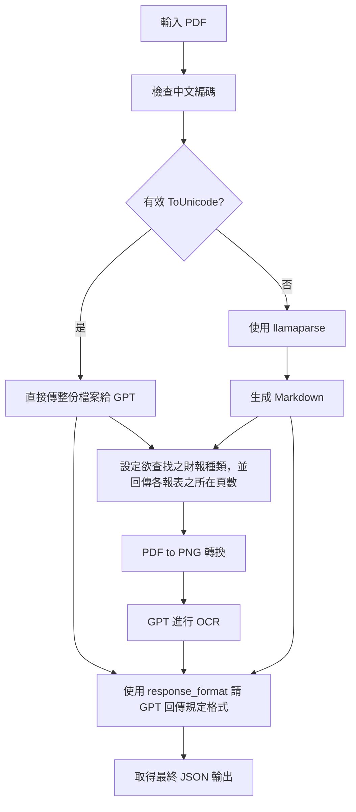

# Financial Report Parser

本專案自動化解析台灣上市櫃公司個體財報 PDF，抽取現金及約當現金、負債等明細，並轉換為結構化 JSON，方便後續分析與應用。

## 特色

- 支援中文 PDF 財報自動解析
- 根據 PDF 內部 ToUnicode 編碼自動選擇最佳解析路徑
- 可抽取現金及約當現金、總負債等多種財報明細
- 支援多種格式（直接 PDF、OCR、Markdown）

## 處理流程



## 資料結構範例

### 現金及約當現金明細表

```json
{
  "現金": {
    "庫存現金": 1000,
    "零用金": 200,
    "週轉金": 0,
    "待交換票據": 0,
    "運送中現金": 0,
    "單位是否為千元": true
  },
  "新台幣存款": {
    "活期性存款(新台幣)": 5000,
    "定期性存款(新台幣)": 10000,
    "支票存款(新台幣)": 0,
    "單位是否為千元": true
  },
  "外幣存款": [
    {
      "幣別": "USD",
      "金額(外幣)": 1000,
      "匯率": 30.5,
      "金額(新台幣)": 30500
    }
  ]
}
```

### 總負債明細表

```json
{
  "短期借款": 100000,
  "國內金融機構借款-長期借款": 50000,
  "單位是否為千元": true,
  "來源頁碼": [12, 13]
}
```

## 注意事項

- 所有數值皆以原始個體財報為主
- 支援多家上市櫃公司財報格式
